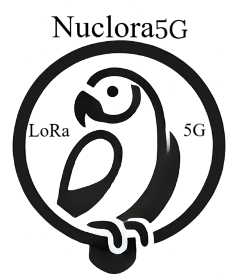

# Proyecto Nuclora5G
## Universidad de Oviedo - Cátedra Thin5G

### Trabajo original desarrollado por Dan García Carrillo, Diego Arias Sal e Ignacio Rodriguez Larrad, como parte de un proyecto académico realizado en la Escuela Politécnica de Ingeniería de Gijón, Universidad de Oviedo, con la colaboración de la Cátedra Thin5G.

  

  
  
  
  

# 📡 Sistema 5G-LoRaWAN Integrado y Seguro

Este proyecto busca desarrollar un sistema **5G-LoRaWAN integrado y seguro**, capaz de gestionar de forma conjunta las transmisiones unidireccionales provenientes de dispositivos IoT dentro de una red LoRaWAN, utilizando funcionalidades inspiradas en redes 5G, garantizando la seguridad de las transmisiones y funcionando sobre los componentes de un núcleo 5G standalone, buscando aprovechar su infraestructura y arquitectura.

El proyecto quiere ofrecer una primera solución que, en el futuro, facilite la gestión conjunta y segura de redes LoRaWAN y 5G en entornos que requieren el uso simultáneo de ambas tecnologías, como la industria, ciudades inteligentes, entre otros, sentando así una base sólida para el desarrollo de futuras iteraciones y mejoras del mismo.

## 🎯 Objetivos

### Objetivo Principal

Obtener un sistema o entorno **5G-LoRaWAN integrado y seguro** capaz de gestionar las transmisiones unidireccionales provenientes de dispositivos IoT, que formen parte de una red LoRaWAN, tanto a nivel de datos como de autenticación, mediante el uso de los componentes y la arquitectura de red de un núcleo 5G standalone.

### Objetivos Secundarios

1. Crear un protocolo de comunicaciones para transmisiones unidireccionales que garantice la integridad, autenticación y confidencialidad de las mismas, aplicable a transmisiones provenientes de dispositivos IoT en redes LoRaWAN.

2. Imitar, en lo posible, las funciones de los componentes de un núcleo 5G Standalone durante la gestión de las transmisiones provenientes de dispositivos IoT u otras transmisiones unidireccionales.

## 🔐 Protocolo de Comunicaciones Unidireccionales Seguras

Con el fin de lograr estos objetivos, se ha diseñado un **nuevo protocolo de comunicaciones unidireccionales seguras**, el cual:
- Se adapta a cualquier tipo de red o transmisión undireccional, siendo necesario solo que los mensajes enviados por los dispositivos sigan los formatos correctos indicados por el protocolo.
- Permite cumplir con las limitaciones propias de redes como LoRaWAN, al requerir de bytes fijos mínimos en el formato requerido por la estructura sus mensajes.
- Sirve como guía para la implementación lógica del sistema 5G-LoRaWAN integrado.
- Aporta seguridad, confidencialidad e integridad a las transmisiones unidireccionales, imitando los protocolos y mecanismos de seguridad de las redes 5G.

## ⚙️ Modos de Despliegue

El proyecto puede utilizarse en tres formas principales:

1. **Sistema 5G-LoRaWAN integrado seguro*  
   Integración con el núcleo de una red 5G, aprovechando su arquitectura para ofrecer una solución IoT segura, robusta y escalable, de manera contenerizada o no.

2. **Gestor seguro independiente de transmisiones LoRaWAN unidireccionales **  
   Utiliza el protocolo de comunicaciones unidireccionales seguras para la gestión segura de transmisiones LoRaWAN unidireccionales, adaptando los mensajes enviados por los dispositivos IoT
   al formato del protocolo.

3. **Gestor seguro de transmisiones unidireccionales*  
   El protocolo, por su naturaleza independiente, puede ser utilizado para gestionar cualquier tipo de transmisión undireccional en cualquier tipo de red, sin las limitaciones propias de LoRaWAN, ya que, el protocolo solo requiere que los mensajes enviados por los dispositivos se adapten al formato del protocolo en su estructura básica, no existiendo límites reales para con el tamaño de los mensajes (fuera del sistema integrado o gestor LoRaWAN) y siendo facilmente adaptable a nuevas necesidades.
---

## 📖 Documentación

Puedes encontrar la documentación completa en el directorio [`docs/`](docs/). También puede valerse de los siguientes enlaces directos:

- 🧩 [Arquitectura de la integración](docs/arquitectura_red_integrada.md)
- 🛡️ [Mecanismos de ciberseguridad](docs/mecanismos_ciberseguridad.md)
- 🛰️ [Protocolo de Comunicaciones Unidireccionales Seguras](docs/protocolo_comunicaciones_unidireccionales_seguras.md)   
- ⚙️ [Despliegue y Configuración](docs/instalacion.md)  
- 📜 [Licencia](LICENSE)  

Para más detalles sobre el proyecto, revisa los archivos en `docs/`.

---

📌 *Este proyecto está en desarrollo y sujeto a cambios.*
