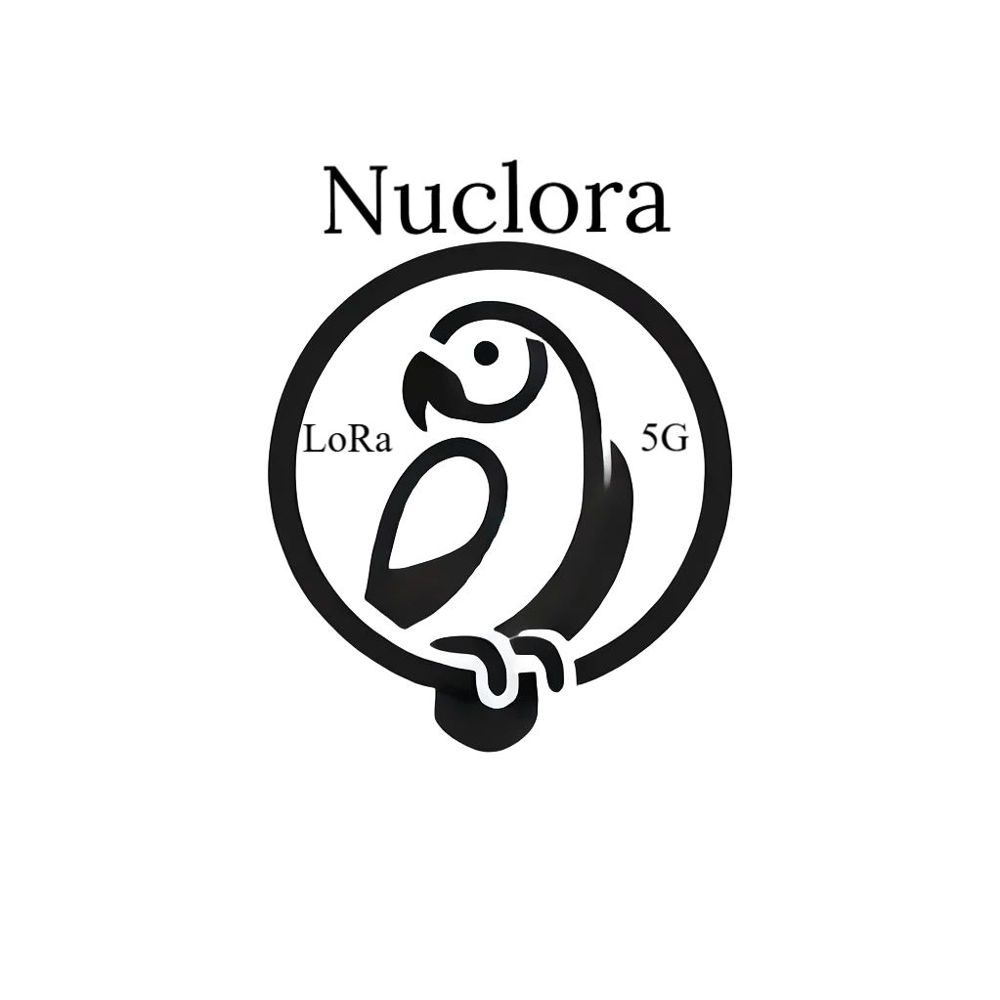

# Proyecto Nuclora

  

El proyecto Nuclora consiste en un gestor de autenticaciones y transmisiones unidireccionales para dispositivos que utilizan tecnología LoRa a través de redes IoT globales, como The Things Network (TTN), o redes locales. Aunque puede funcionar de manera independiente, ha sido diseñado para integrarse en los sistemas que dan servicio a los distintos componentes de un núcleo 5G. Su arquitectura imita los sistemas de seguridad del 5G, pero adaptados a la transmisión unidireccional de datos mínimos, tal como se espera de los dispositivos conectados a una red LoRaWAN.

Este proyecto ha sido realizado como parte del TFG de "D.A.S", alumno de la escuela politécnica de ingeniería, universidad de Oviedo y bajo el amparo de la cátedra Thin5G de dicha universidad.
