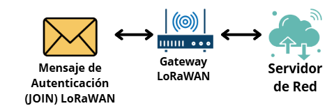
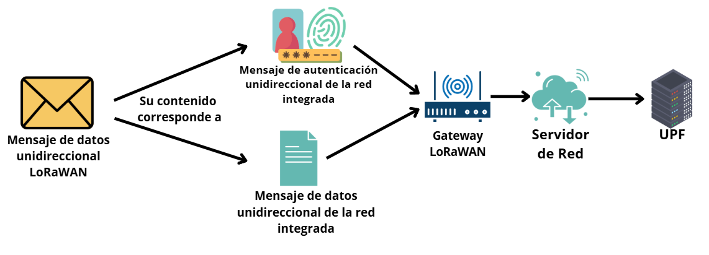
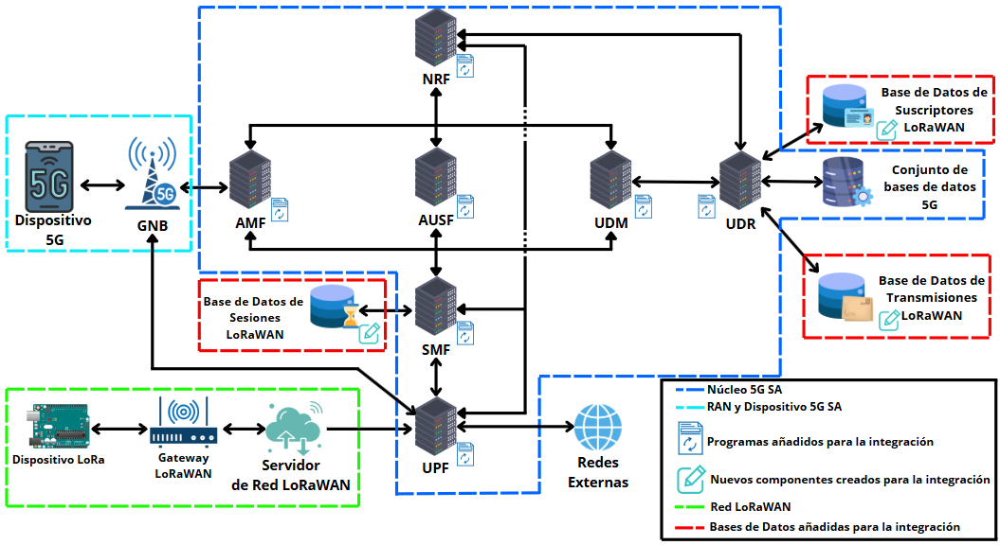
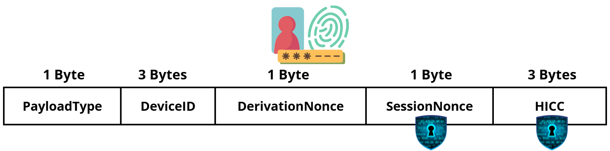
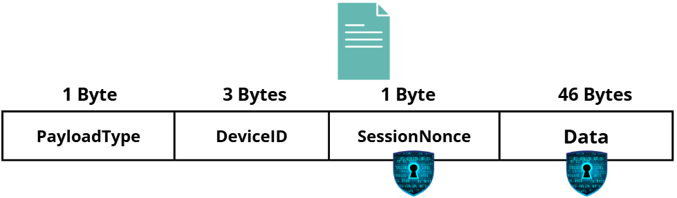

# Arquitectura de Red Integrada 5G-LoRaWAN

Para la integración, se parte de la base de que se mantienen intactas tanto la estructura principal de la red 5G como de la red LoRaWAN. La idea consiste en sustituir el servidor de aplicaciones final de la red LoRaWAN (gestor final) por el UPF, por ser el único componente del núcleo 5G con acceso a redes exteriores.

El proceso de autenticación y sesión inicial mediante transmisiones bidireccionales entre el dispositivo LoRaWAN y su servidor de red LoRaWAN se mantiene idéntico al explicado en la sección anterior y se presupone seguro. Ahora bien, una vez autenticado en su servidor de red, los mensajes de datos unidireccionales de la red LoRaWAN que serán recibidos por el servidor de red y compartidos al servidor de aplicaciones, ahora el UPF, seguirán dos nuevos formatos. Estos mensajes de datos LoRaWAN pasan a dividirse en mensajes de autenticación de la red integrada y mensajes de datos de la red integrada. En las figuras siguientes se ilustran los procesos descritos.

*Figura 1: Flujo de mensajes de autenticación LoRaWAN*

*Figura 2: Nuevos mensajes de la red integrada*

Una vez los nuevos mensajes de la integración sean compartidos por el servidor de red con el UPF, este extraerá la carga útil del mensaje, eliminando cabeceras propias añadidas por el servidor de red, que no serán necesarias, y lo reenviará al SMF, por ser este la única conexión permanente del UPF con otro componente del núcleo 5G (en plano de control y sin contar el NRF).

El SMF, encargado en 5G del manejo de sesiones, detectará si el mensaje recibido tiene formato de autenticación de la red integrada o de datos. En caso de mensaje de autenticación, lo reenviará al AMF para que comience un proceso de autenticación que imitará la estructura del de 5G, más robusto que el de LoRaWAN.

La naturaleza unidireccional de las comunicaciones en el sistema integrado, al contrario que la bidireccional de 5G, no permite realizar múltiples de los pasos que realiza una autenticación 5G completa, por lo que, la seguridad de la integración se centra en el concepto general de cada paso, imitándolo mediante procesos con objetivos similares que se adecúen a las limitaciones unidireccionales, en lugar de replicarlo. Si la autenticación se produce satisfactoriamente, se abrirá una sesión de datos para el usuario de la red integrada.

En caso de mensaje de datos, el SMF comprobará si existe una sesión abierta para el usuario en la red integrada, si es así, y el mensaje de datos es correcto, se reenviará al UDM y este a su vez al UDR para su almacenamiento y registro.

Para dotar de capacidad al núcleo 5G de realizar estos nuevos procesos con los datos recibidos desde la red LoRaWAN, se añadirán múltiples programas (*scripts*) independientes a cada uno de los componentes para realizar las funciones que le correspondan. Además, se dotará al sistema de tres nuevas bases de datos: sesiones, situada en el SMF, suscriptores, y transmisiones, ambas situadas en el UDR. Las nuevas funciones de cada componente y la estructura de las nuevas bases de datos se detallan en secciones posteriores.

Los usuarios (dispositivos IoT) provenientes de la red LoRaWAN deberán estar suscritos a la red integrada, registrándose mediante un proceso fuera de banda (*out of band*).

Los mensajes, ya sean de autenticación como de datos, viajarán cifrados y se garantizará en todo momento su confidencialidad y autenticación. En el caso de un mensaje de autenticación, también se garantiza su integridad y, en caso de mensajes de datos, el sistema integrado es capaz de detectar la pérdida de mensajes anteriores, aunque no de solicitar su retransmisión (por limitación unidireccional de la transmisión).

La arquitectura de la integración, los componentes originales de las redes 5G y LoRaWAN y aquellos añadidos o modificados, se representan en la siguiente figura.

*Figura 3: Arquitectura de Red Integrada 5G-LoRaWAN*

En las siguientes secciones, se profundizará en cada uno de los campos mencionados en esta sección. Comenzando por los tipos de mensajes de la red integrada, es decir, aquellos provenientes de la red LoRaWAN pero con nuevo formato, para seguir con los campos de las distintas nuevas bases de datos, procesos de cifrado, flujos de mensajes, etc.

## Tipos de Mensaje

Como se ha explicado previamente, existirán dos tipos de mensajes en la red integrada provenientes de LoRaWAN, de autenticación y de datos, en las siguientes subsecciones se detalla cada uno de ellos.

Se ha utilizado para el diseño un tamaño máximo de mensajes de 51 bytes. Este tamaño se obtiene considerando el mayor factor de expansión (*spreading factor, SF*) posible, SF12, y teniendo en cuenta que, en la comunicación entre el punto de acceso LoRaWAN y el servidor de red, se pueden añadir hasta 8 bytes de comandos MAC, lo cual permite el menor tamaño de mensaje, actuando este como caso límite. Los bytes libres pueden ser ampliados y utilizados a futuro según se considere necesario e incluso superar el límite de los 51 bytes si se pretenden utilizar SF menores.

### Mensaje de Autenticación

Mensaje que un suscriptor debe enviar para abrir una sesión para la transmisión de datos. A continuación se detallan los campos que componen la estructura de este mensaje. Los valores entre corchetes [] indican el tamaño del campo y si este se transmitirá o no cifrado.

Su tamaño es de 9 bytes fijos, dejando 42 bytes libres con los que puede ser ampliado para futuras necesidades o extensiones. Su estructura puede observarse en la siguiente figura, además, se describen sus campos de forma posterior.

- **PayloadType:** Identifica el tipo de contenido del *payload* para su correcta gestión. En el caso de los mensajes de autenticación, tendrá el valor binario `0b00000000` (0 decimal). [1 BYTE, NO CIFRADO]

- **DeviceID:** Identificador único del dispositivo LoRa que envía el mensaje. [3 BYTES, NO CIFRADO]

- **DerivationNonce:** Valor generado aleatoriamente que se utilizará para la derivación de claves de encriptado junto con el `DeviceID` y la `PSK`. [1 BYTE, NO CIFRADO]

- **SessionNonce:** Valor generado aleatoriamente que se utilizará para la identificación y seguimiento de la sesión en caso de que la autenticación se produzca satisfactoriamente. [1 BYTE, CIFRADO]

- **HICC (HASH INTEGRITY CHECK CODE):** Valor de los 3 primeros bytes del *hash* `MD5` del resto del mensaje de autenticación, sin contar estos 3 bytes. El *hash* se calcula antes de cifrar los campos. [3 BYTES, CIFRADO]

---

### Mensaje de Datos

Mensaje que un dispositivo ya autenticado y con una sesión abierta debe enviar con los datos que desea transmitir.

Su tamaño mínimo es de 5 bytes fijos para la identificación y comprobación de la sesión. Cuenta con 46 bytes libres para los propios datos (u otras funciones que se le quieran dar), ampliables para factores de expansión (SF) menores. A continuación se detallan los campos que componen la estructura de este mensaje. Los valores entre corchetes [] indican el tamaño del campo y si este viajará o no cifrado. Su estructura también se muestra en la siguiente figura.

- **PayloadType:** Identifica el tipo de contenido del *payload* para su correcta gestión. Su valor variará en función del origen, trato o uso de los datos que se quieran transmitir. (Ejemplo: `0b00000001` - Datos de sensor de temperatura). El valor `0b00000000` está reservado para mensajes de autenticación, quedando 255 valores libres para los usos particulares. [1 BYTE, NO CIFRADO]

- **DeviceID:** Identificador único del dispositivo LoRa que envía el mensaje. [3 BYTES, NO CIFRADO]

- **SessionNonce:** Valor utilizado para el seguimiento de la sesión abierta. Su primer valor será igual al que se utilizó en el mismo campo del mensaje de autenticación que abrió la sesión actual, posteriormente, se incrementará en 1 secuencialmente (en ciclos de 0-255) por cada mensaje enviado en la misma sesión. [1 BYTE, CIFRADO]

- **Data:** Datos que se desean transmitir en función del tipo de *payload*, uso y objetivo.  
[Sin tamaño mínimo. Tamaño máximo variable en función del SF. Capacidad mínima para al menos 46 bytes (SF12), CIFRADO]

