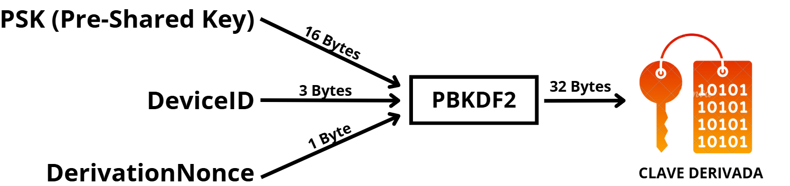
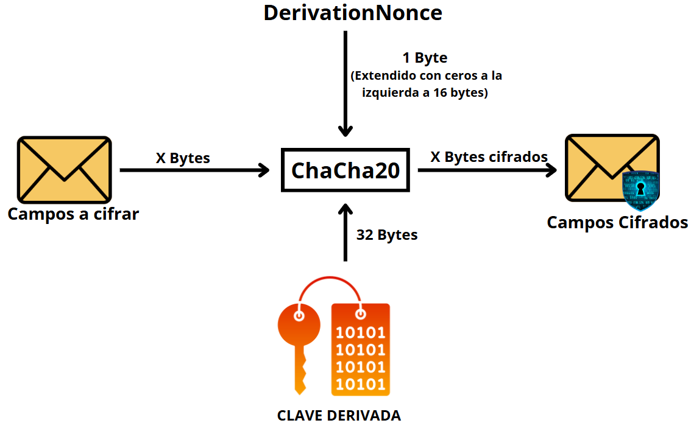

# Procesos y Mecanismos de Seguridad

En esta sección se describen los procesos y mecanismos de derivación de claves, cifrado y posible codificación que se realizarán durante dichos flujos. Estos mecanismos son necesarios para poder otorgarle al entorno integrado la cualidad de seguro.

El dispositivo/suscriptor deberá emplear estos mecanismos para el envío y cifrado de sus mensajes, permitiendo al núcleo realizar los procesos propios o contrarios de manera correcta. En caso contrario, los mensajes, ya sean de autenticación o cifrado, serán descartados durante su flujo de mensajes específico, al no poder garantizarse la identidad del emisor o la integridad de las comunicaciones.

## Derivación de Claves

Para derivar claves se utilizará el algoritmo PBKDF2, pasándole como argumentos necesarios: la clave previamente compartida (PSK) del suscriptor, de tamaño 16 bytes, el identificador del dispositivo/suscriptor (DeviceID), de 3 bytes, y el valor aleatorio generado para la derivación, (DerivationNonce), de 1 byte. Como resultado se obtiene una clave derivada de 32 bytes de longitud.

Suponiendo que las PSK se generen de manera aleatoria para cada dispositivo y los identificadores, *DeviceID*, son secuenciales, se obtiene una entropía de 136 bits, suficiente para ser “invulnerable” a ataques de fuerza bruta (16 bytes aleatorios de PSK, 1 byte aleatorio de DerivationNonce, total de 17 bytes aleatorios, es decir, 136 bits de entropía).

En la siguiente imagen se representa un esquema del proceso de derivación.

## Cifrado

Para el cifrado de los campos de los mensajes se utilizará el algoritmo de cifrado de flujo Chacha20. Se le pasarán como argumentos: la clave derivada de 32 bytes, el *DerivationNonce* de 1 byte, que se extenderá a 16 bytes añadiéndole ceros a la izquierda, y los campos a cifrar. Como resultado se obtienen los campos cifrados, manteniendo su mismo tamaño original.

Utilizar en el cifrado el mismo *DerivationNonce* que en la derivación, no afecta a la seguridad, ya que la clave derivada ya aporta la “aleatoriedad” necesaria al usarlo. Esto ahorra tener que enviar más bytes para el cifrado.

Chacha20 requiere un *nonce* de 8, 12 o 16 bytes para funcionar (según la versión utilizada), por eso, en este caso, se extiende el DerivationNonce añadiéndole ceros a la izquierda. No afecta en demasía a la seguridad por la consideración del párrafo previo.

Se ha escogido este cifrado de flujo porque requiere menos bytes extra para su funcionamiento que otros, y no altera el tamaño del mensaje original.

En la siguiente imagen se muestra un esquema del proceso de cifrado.

## Codificación de Datos

Por lo general, no es rentable utilizar sistemas de codificación para los datos del mensaje, pues su formato directo en bytes y su pequeño tamaño provoca que, en la gran mayoría de los casos, la codificación añada bytes extra (por cabeceras) en lugar de reducir su número.

En casos muy específicos, donde los datos sean muy repetitivos, la codificación sí que podría llegar a reducir el tamaño, por lo que se agrega al UPF, como punto de entrada al núcleo, la capacidad de identificar el tipo de datos enviados y decodificarlos en caso de que sea necesario. Se deja la decisión sobre si codificar o no, así como la implementación de su correcta decodificación en el archivo correspondiente del UPF, al hipotético futuro operador en el momento de definir los tipos de datos que sus suscriptores puedan enviar.
