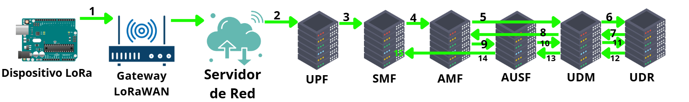
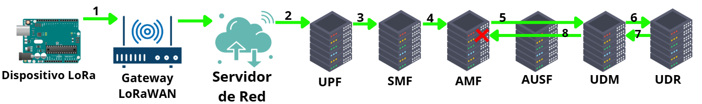
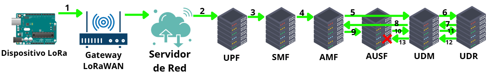
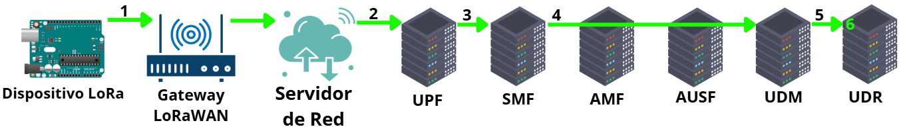
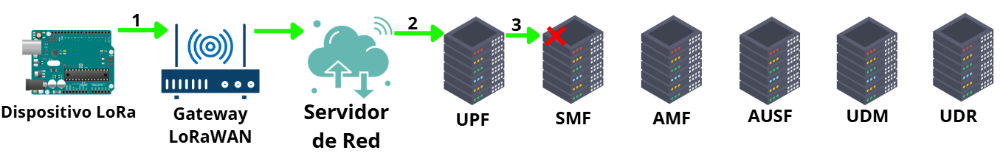

# Protocolo de Comunicaciones Unidireccionales Seguras

A continuación se enumeran y describen los pasos que se sucederían en la transmisión de un mensaje de autenticación, suponiendo la correcta superación de todos los niveles de autenticación. Los encabezados indican el elemento actuando en cada momento. Además, en la siguiente figura se detalla un esquema simplificado del recorrido del mensaje a lo largo de los elementos que componen la red integrada segura.

## Flujo de mensajes de autenticación suponiendo autenticación exitosa

1. **Dispositivo Suscriptor**:
    1. Genera `DerivationNonce` y `SessionNonce`.
    2. Utiliza su `PSK`, su `DeviceID` y su `DerivationNonce` para generar la clave derivada.
    3. Genera el mensaje de autenticación cifrando los campos necesarios con la clave derivada. (ver sección de mensajes de autenticación)
    4. Envía el mensaje de autenticación a su *gateway* para ser reenviado al servidor de red. En este proyecto, como ejemplo, TTN.

2. **Servidor de red LoRaWAN**:
    1. Publica como *bróker* el mensaje recibido para que el UPF, suscriptor al *bróker*, obtenga el mensaje (equivalente a reenviarlo directamente al UPF, pero aprovechando la capacidad de *bróker* de TTN).

3. **UPF**:
    1. Identifica el tipo de payload a partir del campo `PayloadType`. Según el tipo, realiza decodificaciones previas o tratamientos especiales según se haya definido para ese tipo. En este caso, al ser un mensaje de autenticación, no realiza nada.
    2. Reenvía el mensaje al SMF.

4. **SMF**:
    1. Identifica a partir del campo `PayloadType` si es un mensaje de autenticación o de datos, en este caso, autenticación.
    2. Reenvía el mensaje al AMF para comenzar el primer nivel de autenticación.

5. **AMF**:
    1. Extrae el campo `DeviceID` del mensaje de autenticación.
    2. Envía el `DeviceID` al UDM, preguntándole si existe algún suscriptor registrado en la base de datos de suscriptores con dicho `DeviceID`.

6. **UDM**:
    1. Reenvía el `DeviceID` al UDR y espera la respuesta de este.

7. **UDR**:
    1. Comprueba si el `DeviceID` se encuentra en alguna fila de la base de datos de suscriptores. En este caso, sí.
    2. Contesta afirmativamente al UDM con la cadena “FL_Success”.

8. **UDM**:
    1. Contesta afirmativamente al AMF con la cadena “FL_Success”.

9. **AMF**:
    1. Da por superado el primer nivel de autenticación (autenticado a nivel de *visited network*).
    2. Reenvía el mensaje de autenticación al AUSF para comenzar el segundo nivel de autenticación.

10. **AUSF**:
    1. Extrae el `DeviceID` y el `DerivationNonce` del mensaje de autenticación.
    2. Envía el `DeviceID` y el `DerivationNonce` al UDM con el objetivo de que el UDR le genere la clave derivada.

11. **UDM**:
    1. Reenvía el `DeviceID` y el `DerivationNonce` al UDR.

12. **UDR**:
    1. Obtiene de la base de datos de suscriptores la `PSK` y la `SessionDuration` correspondientes al `DeviceID`.
    2. Genera la clave derivada a partir del `DeviceID`, `DerivationNonce` y la `PSK`.
    3. Contesta al UDM con la clave derivada y la `SessionDuration`.

13. **UDM**:
    1. Contesta al AUSF con la clave derivada y la `SessionDuration`.

14. **AUSF**:
    1. Utiliza la clave derivada y el `DerivationNonce` para descifrar el campo `HICC` del mensaje de autenticación.
    2. Genera el hash md5 del mensaje de autenticación sin el `HICC` y comprueba que los 3 primeros bytes coincidan con el `HICC`. En este caso, sí. Segundo nivel de autenticación superado. Integridad e identificación del mensaje confirmada a nivel de *home network*.
    3. Descifra `SessionNonce`.
    4. Envía `DeviceID`, clave derivada, `DerivationNonce`, `SessionNonce` y `SessionDuration` al SMF.

15. **SMF**:
    1. Crea una nueva fila en la base de datos de sesiones insertando los datos recibidos del AUSF en los campos correspondientes (ver sección de bases de datos).
    2. La sesión ha sido abierta para el suscriptor.

---

## Flujo de Mensajes - Mensaje de Autenticación Suponiendo Fallo en el Primer Nivel de Autenticación

Se presupone ahora que existe un fallo en el primer nivel de autenticación, es decir, en la identificación inicial del dispositivo por parte del AMF.

El flujo de mensajes será idéntico al flujo completo hasta el paso 6. En el paso 7, el UDR fallará al buscar el `DeviceID` y contestará al UDM y, a su vez, este al AMF con la cadena `FL_FAILURE`. El AMF descarta el mensaje de autenticación al no haberse superado el primer nivel de autenticación. Se marcan en azul los pasos que difieren.

1. **Dispositivo Suscriptor**:
    1. Genera `DerivationNonce` y `SessionNonce`.
    2. Utiliza su `PSK`, su `DeviceID` y su `DerivationNonce` para generar la clave derivada.
    3. Genera el mensaje de autenticación cifrando los campos necesarios con la clave derivada. (ver sección de mensajes de autenticación)
    4. Envía el mensaje de autenticación a su *gateway* para ser reenviado al servidor de red. En este proyecto, como ejemplo, TTN.

2. **Servidor de red LoRaWAN**:
    1. Publica como *bróker* el mensaje recibido para que el UPF, suscriptor al *bróker*, obtenga el mensaje (equivalente a reenviarlo directamente al UPF, pero aprovechando la capacidad de *bróker* de TTN).

3. **UPF**:
    1. Identifica el tipo de payload a partir del campo `PayloadType`. Según el tipo, realiza decodificaciones previas o tratamientos especiales según se haya definido para ese tipo. En este caso, al ser un mensaje de autenticación, no realiza nada.
    2. Reenvía el mensaje al SMF.

4. **SMF**:
    1. Identifica a partir del campo `PayloadType`, si es un mensaje de autenticación o de datos, en este caso, autenticación.
    2. Reenvía el mensaje al AMF para comenzar el primer nivel de autenticación.

5. **AMF**:
    1. Extrae el campo `DeviceID` del mensaje de autenticación.
    2. Envía el `DeviceID` al UDM, preguntándole si existe algún suscriptor registrado en la base de datos de suscriptores con dicho `DeviceID`.

6. **UDM**:
    1. Reenvía el `DeviceID` al UDR y espera la respuesta de este.

7. **UDR**:
    1. Comprueba si el `DeviceID` se encuentra en alguna fila de la base de datos de suscriptores. En este caso, no.
    2. Contesta negativamente al UDM con la cadena `FL_Failure`.

8. **UDM**:
    1. Contesta negativamente al AMF con la cadena `FL_Failure`.

9. **AMF**:
    1. El AMF confirma que ha fallado el primer nivel de autenticación.
    2. Se descarta el mensaje de autenticación.

---

## Flujo de Mensajes - Mensaje de Autenticación Suponiendo Fallo en el Segundo Nivel de Autenticación

Se presupone ahora un fallo en el segundo nivel de autenticación, es decir, el AUSF fallaría al igualar el `HICC` descifrado con el generado a partir de los campos correspondientes del mensaje recibido.

El flujo de mensajes será idéntico al flujo completo hasta el paso 13. En el paso 14, el AUSF fallará al comprobar que el `HICC` descifrado se corresponde con el generado a partir del hash obtenido del mensaje con campos descifrados a partir de la clave generada. Fallo en el segundo nivel de autenticación, se descarta el mensaje de autenticación. Se marcan en azul los pasos que difieren.

1. **Dispositivo Suscriptor**:
    1. Genera `DerivationNonce` y `SessionNonce`.
    2. Utiliza su `PSK`, su `DeviceID` y su `DerivationNonce` para generar la clave derivada.
    3. Genera el mensaje de autenticación cifrando los campos necesarios con la clave derivada. (ver sección de mensajes de autenticación)
    4. Envía el mensaje de autenticación a su *gateway* para ser reenviado al servidor de red. En este proyecto, como ejemplo, TTN.

2. **Servidor de red LoRaWAN**:
    1. Publica como *bróker* el mensaje recibido para que el UPF, suscriptor al *bróker*, obtenga el mensaje (equivalente a reenviarlo directamente al UPF, pero aprovechando la capacidad de *bróker* de TTN).

3. **UPF**:
    1. Identifica el tipo de payload a partir del campo `PayloadType`. Según el tipo, realiza decodificaciones previas o tratamientos especiales según se haya definido para ese tipo. En este caso, al ser un mensaje de autenticación, no realiza nada.
    2. Reenvía el mensaje al SMF.

4. **SMF**:
    1. Identifica a partir del campo `PayloadType`, si es un mensaje de autenticación o de datos, en este caso, autenticación.
    2. Reenvía el mensaje al AMF para comenzar el primer nivel de autenticación.

5. **AMF**:
    1. Extrae el campo `DeviceID` del mensaje de autenticación.
    2. Envía el `DeviceID` al UDM, preguntándole si existe algún suscriptor registrado en la base de datos de suscriptores con dicho `DeviceID`.

6. **UDM**:
    1. Reenvía el `DeviceID` al UDR y espera la respuesta de este.

7. **UDR**:
    1. Comprueba si el `DeviceID` se encuentra en alguna fila de la base de datos de suscriptores. En este caso, sí.
    2. Contesta afirmativamente al UDM con la cadena `FL_Success`.

8. **UDM**:
    1. Contesta afirmativamente al AMF con la cadena `FL_Success`.

9. **AMF**:
    1. El AMF da por superado el primer nivel de autenticación (Autenticado a nivel de *visited network*).
    2. Reenvía el mensaje de autenticación al AUSF para comenzar el segundo nivel de autenticación.

10. **AUSF**:
    1. Extrae el `DeviceID` y el `DerivationNonce` del mensaje de autenticación.
    2. Envía el `DeviceID` y el `DerivationNonce` al UDM con el objetivo de que el UDR le genere la clave derivada.

11. **UDM**:
    1. Reenvía el `DeviceID` y el `DerivationNonce` al UDR.

12. **UDR**:
    1. Obtiene de la base de datos de suscriptores la `PSK` y la `SessionDuration` correspondientes al `DeviceID`.
    2. Genera la clave derivada a partir del `DeviceID`, `DerivationNonce` y la `PSK`.
    3. Contesta al UDM con la clave derivada y la `SessionDuration`.

13. **UDM**:
    1. Contesta al AUSF con la clave derivada y la `SessionDuration`.

14. **AUSF**:
    1. Utiliza la clave derivada y el `DerivationNonce` para descifrar el campo `HICC` del mensaje de autenticación.
    2. Genera el hash md5 del mensaje de autenticación sin el `HICC` y comprueba que los 3 primeros bytes coincidan con el `HICC`. En este caso, no. Segundo nivel de autenticación no superado.
    3. Se descarta el mensaje de autenticación.

## Flujo de Mensajes - Mensaje de Datos Suponiendo Sesión Abierta con *SessionNonce* Coincidente

A continuación se enumeran y describen los pasos que se sucederían en la transmisión de un mensaje de datos, suponiendo que existe una sesión abierta previamente para el suscriptor y que el *SessionNonce* recibido coincide con el esperado. 

1. **Dispositivo Suscriptor**:
    1. Genera el mensaje de datos utilizando el mismo DerivationNonce y SessionNonce que utilizó previamente para el mensaje de autenticación y, por tanto, cifrando los campos SessionNonce y Data con la misma clave derivada.
    2. Envía el mensaje de autenticación a su *gateway* para ser reenviado al servidor de red. En este proyecto, como ejemplo, TTN.

2. **Servidor de red LoRaWAN**:
    1. Publica como *bróker* el mensaje recibido para que el UPF, suscriptor al *bróker*, obtenga el mensaje (equivalente a reenviarlo directamente al UPF, pero aprovechando la capacidad de *bróker* de TTN).

3. **UPF**:
    1. Identifica el tipo de *payload* a partir del campo PayloadType. Según el tipo, realiza decodificaciones previas o tratamientos especiales según se haya definido para ese tipo.
    2. Reenvía el mensaje al SMF.

4. **SMF**:
    1. Identifica a partir del campo PayloadType, si es un mensaje de autenticación o de datos, en este caso, datos.
    2. Extrae el DeviceID del mensaje de datos y comprueba si existe una fila con ese DeviceID en la BD de sesiones, es decir, si existe una sesión abierta asociada. En este caso, sí.
    3. Obtiene de la BD de sesiones el SessionNonce, la clave derivada y el DerivationNonce correspondientes a la sesión activa correspondiente.
    4. Utiliza la clave derivada y el DerivationNonce para descifrar el campo SessionNonce del mensaje de datos y comprobar que coincide con el que estaba almacenado en la BD de sesiones. En este caso, sí.
    5. Aumenta en 1 el valor del SessionNonce y el SessionCounter almacenados en la BD de sesiones para el DeviceID (para la sesión activa). Si el valor de SessionCounter es igual o superior al valor de SessionDuration, se elimina la fila de la BD de sesiones, cerrando así la sesión activa.
    6. Utiliza la clave derivada y el DerivationNonce para descifrar el campo Data del mensaje de datos.
    7. Se envían al UDM el DeviceID, el PayloadType y Data.

5. **UDM**:
    1. Reenvía el DeviceID, el PayloadType y Data al UDR.

6. **UDR**:
    1. Añade una fila a la BD de transmisiones con los datos recibidos.

---

## Flujo de Mensajes - Mensaje de Datos Suponiendo Sin Sesión Abierta

Se presupone ahora que no existe una sesión previamente abierta para las transmisiones de datos del dispositivo, es decir, el mensaje será descartado por el SMF.  

El flujo de mensajes será idéntico al flujo anterior hasta el punto 3. En el punto 4.2, la comprobación fallará y el mensaje de datos será descartado. Se marcan en azul los pasos que difieren.

1. **Dispositivo Suscriptor**:
    1. Genera el mensaje de datos utilizando el mismo DerivationNonce y SessionNonce que utilizó previamente para el mensaje de autenticación y, por tanto, cifrando los campos SessionNonce y Data con la misma clave derivada.
    2. Envía el mensaje de autenticación a su *gateway* para ser reenviado al servidor de red. En este proyecto, como ejemplo, TTN.

2. **Servidor de red LoRaWAN**:
    1. Publica como *bróker* el mensaje recibido para que el UPF, suscriptor al *bróker*, obtenga el mensaje (equivalente a reenviarlo directamente al UPF, pero aprovechando la capacidad de *bróker* de TTN).

3. **UPF**:
    1. Identifica el tipo de *payload* a partir del campo PayloadType. Según el tipo, realiza decodificaciones previas o tratamientos especiales según se haya definido para ese tipo.
    2. Reenvía el mensaje al SMF.

4. **SMF**:
    1. Identifica a partir del campo PayloadType, si es un mensaje de autenticación o de datos, en este caso, datos.
    2. Extrae el DeviceID del mensaje de datos y comprueba si existe una fila con ese DeviceID en la BD de sesiones, es decir, si existe una sesión abierta asociada. En este caso, no.
    3. Se descarta el mensaje de datos. 

---

## Flujo de Mensajes - Mensaje de Datos Suponiendo Sesión Abierta, pero *SessionNonce* No Coincidente y Fuera de Rango

Se presupone ahora que existe una sesión abierta, pero el campo SessionNonce del mensaje de datos transmitido no coincide con el siguiente esperado y tampoco se encuentra dentro del rango de los posibles, [SessionNonce almacenado, SessionNonce almacenado + SessionDuration - SessionCounter]. 

El flujo de mensajes será idéntico al flujo del primer caso hasta el punto 3. En el punto 4.4, el SessionNonce no coincidirá con el almacenado y, además, estará fuera del rango de mensajes esperado. El mensaje será descartado, la sesión permanecerá abierta y sin modificar. Se marcan en azul los pasos que difieren.

1. **Dispositivo Suscriptor**:
    1. Genera el mensaje de datos utilizando el mismo DerivationNonce y SessionNonce que utilizó previamente para el mensaje de autenticación y, por tanto, cifrando los campos SessionNonce y Data con la misma clave derivada.
    2. Envía el mensaje de autenticación a su *gateway* para ser reenviado al servidor de red. En este proyecto, como ejemplo, TTN.

2. **Servidor de red LoRaWAN**:
    1. Publica como *bróker* el mensaje recibido para que el UPF, suscriptor al *bróker*, obtenga el mensaje (equivalente a reenviarlo directamente al UPF, pero aprovechando la capacidad de *bróker* de TTN).

3. **UPF**:
    1. Identifica el tipo de *payload* a partir del campo PayloadType. Según el tipo, realiza decodificaciones previas o tratamientos especiales según se haya definido para ese tipo.
    2. Reenvía el mensaje al SMF.

4. **SMF**:
    1. Identifica a partir del campo PayloadType, si es un mensaje de autenticación o de datos, en este caso, datos.
    2. Extrae el DeviceID del mensaje de datos y comprueba si existe una fila con ese DeviceID en la BD de sesiones, es decir, si existe una sesión abierta asociada. En este caso, sí.
    3. Obtiene de la BD de sesiones el SessionNonce, la clave derivada y el DerivationNonce correspondientes a la sesión activa correspondiente.
    4. Utiliza la clave derivada y el DerivationNonce para descifrar el campo SessionNonce del mensaje de datos y comprobar que coincide con el que estaba almacenado en la BD de sesiones. En este caso, no, y se encuentra fuera del rango esperado.
    5. Se descarta el mensaje recibido.

---

## Flujo de Mensajes - Mensaje de Datos Suponiendo Sesión Abierta pero *SessionNonce* No Coincidente y Dentro de Rango

Se presupone ahora que existe una sesión abierta, pero el campo SessionNonce del mensaje de datos transmitido no coincide con el siguiente esperado, pero se encuentra dentro del rango de los posibles [SessionNonce almacenado, SessionNonce almacenado + SessionDuration - SessionCounter]. 

El flujo de mensajes será idéntico al flujo del primer caso hasta el punto 3. En el punto 4.4, el SessionNonce no coincidirá con el almacenado y, además, estará dentro del rango esperado. El valor del SessionNonce en la base de datos de sesiones se igualará al recibido y el SessionCounter se aumentará en [número de mensajes perdidos] + 1 veces. El sistema asume que se han perdido [SessionNonce recibido - SessionNonce almacenado] mensajes. Se marcan en azul los pasos que difieren.

1. **Dispositivo Suscriptor**:
    1. Genera el mensaje de datos utilizando el mismo DerivationNonce y SessionNonce que utilizó previamente para el mensaje de autenticación y, por tanto, cifrando los campos SessionNonce y Data con la misma clave derivada.
    2. Envía el mensaje de autenticación a su *gateway* para ser reenviado al servidor de red. En este proyecto, como ejemplo, TTN.

2. **Servidor de red LoRaWAN**:
    1. Publica como *bróker* el mensaje recibido para que el UPF, suscriptor al *bróker*, obtenga el mensaje (equivalente a reenviarlo directamente al UPF, pero aprovechando la capacidad de *bróker* de TTN).

3. **UPF**:
    1. Identifica el tipo de *payload* a partir del campo PayloadType. Según el tipo, realiza decodificaciones previas o tratamientos especiales según se haya definido para ese tipo.
    2. Reenvía el mensaje al SMF.

4. **SMF**:
    1. Identifica a partir del campo PayloadType, si es un mensaje de autenticación o de datos, en este caso, datos.
    2. Extrae el DeviceID del mensaje de datos y comprueba si existe una fila con ese DeviceID en la BD de sesiones, es decir, si existe una sesión abierta asociada. En este caso, sí.
    3. Obtiene de la BD de sesiones el SessionNonce, la clave derivada y el DerivationNonce correspondientes a la sesión activa correspondiente.
    4. Utiliza la clave derivada y el DerivationNonce para descifrar el campo SessionNonce del mensaje de datos y comprobar que coincide con el que estaba almacenado en la BD de sesiones. En este caso, no, pero se encuentra dentro del rango esperado.
    5. El sistema asume que se han perdido [SessionNonce recibido - SessionNonce almacenado] mensajes.
    6. Se actualiza la BD de sesiones, igualando el SessionNonce almacenado con el recibido, e incrementando en [SessionNonce recibido - SessionNonce almacenado] + 1 el SessionCounter de la sesión. Si el valor de SessionCounter es igual o superior al valor de SessionDuration, se elimina la fila de la BD de sesiones, cerrando así la sesión activa.
    7. Utiliza la clave derivada y el DerivationNonce para descifrar el campo Data del mensaje de datos.
    8. Se envían al UDM el DeviceID, el PayloadType y Data.

5. **UDM**:
    1. Reenvía el DeviceID, el PayloadType y Data al UDR.

6. **UDR**:
    1. Añade una fila a la BD de transmisiones con los datos recibidos.
